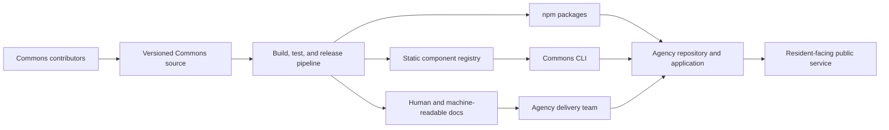

# Commons architecture overview

_Status: working architecture · Audience: agency architects, security reviewers,
implementers, and Commons contributors · Last reviewed: 2026-07-15_

## Executive summary

Commons is an open-source design system and source-distribution toolchain for
U.S. local government. Its core job is to turn versioned design tokens,
accessibility requirements, and component source into artifacts that a public
institution can inspect, install, modify, test, and operate in its own
environment.

The core architecture is deliberately low-dependency:

- tokens compile to CSS custom properties and JSON;
- framework-agnostic foundations ship as CSS, and the components themselves ship
  as `.cui-*` classes (`@21stgov/commons-css`) plus a small enhancement runtime
  (`@21stgov/commons-js`) for use without React;
- React components build on Base UI primitives;
- a static registry describes and distributes component source;
- the Commons CLI previews and installs that source into an adopter’s
  repository; and
- documentation and registry assets can be served as static, cacheable content.

Commons is not a hosted resident-data system. The packages do not require an
account, database, telemetry service, or Commons-operated runtime. Optional
hosted services — the read-only MCP interface (`mcp.commonsui.com`) and the
first-party asset CDN (`cdn.commonsui.com`) — are separate system boundaries
that publish their own data and security documentation.

## System context



The adopting government owns and operates the final application. Commons
provides tested foundations and evidence, but it does not control the adopter’s
content, integrations, infrastructure, customizations, or release process.

## Monorepo boundaries

| Boundary          | Responsibility                                                                                | Runtime network access                               |
| ----------------- | --------------------------------------------------------------------------------------------- | ---------------------------------------------------- |
| `packages/tokens` | DTCG token sources, theme compilation, resolved JSON, contrast validation                     | None                                                 |
| `packages/core`   | Framework-agnostic reset, base CSS, and accessibility utilities                               | None                                                 |
| `packages/css`    | `commons.css` — the `.cui-*` component classes, generated from the React components            | None                                                 |
| `packages/js`     | Progressive-enhancement runtime that makes `.cui-*` markup interactive without React           | None                                                 |
| `packages/react`  | React utilities and components built on accessible primitives                                 | None by default                                      |
| `packages/cli`    | Configuration, registry resolution, installation planning, and—in Phase 1—source installation | Public registry reads                                |
| `apps/docs`       | Documentation site and registry publication surface                                           | Build-time and public content delivery only to start |

Package boundaries are intentional. A server-rendered municipal site can adopt
tokens and core CSS without React — and, with `commons-css` (`.cui-*` component
classes) and the `commons-js` enhancement runtime, the full component set with
no framework. A React application can use the component package. A team that
wants source ownership can use the CLI and registry.

## Build and release flow

```text
DTCG token source
      │
      ├──> generated CSS variables
      ├──> resolved JSON
      └──> automated contrast validation
                   │
                   ▼
framework-agnostic core CSS
                   │
                   ▼
React components + examples + accessibility contracts
                   │
                   ▼
versioned registry items + package releases + documentation
```

The token build is upstream of core and React. Registry items must identify
their files, package dependencies, registry dependencies, documentation, and
theme changes. The release process should eventually attach checksums,
provenance, an SBOM, and test evidence to every published version.

Generated files must be reproducible from committed source. Generated outputs
must not become an independent source of truth.

## Adoption modes

### 1. Source-owned React adoption

The agency initializes Commons and adds selected components through the CLI.
Component source is copied into the agency repository. The agency can inspect,
adapt, test, and version that source with the rest of its application.

This is the primary Commons model. It reduces runtime lock-in, but it creates a
shared maintenance responsibility: Commons publishes upgrade guidance and
diffs; the agency decides when and how to merge them.

### 2. Framework-agnostic path

The agency consumes `@21stgov/commons-tokens` and `@21stgov/commons-core` in an
existing server-rendered, static, or non-React application — for token-only
restyling, no Commons JavaScript is required. Adding `@21stgov/commons-css`
brings the full `.cui-*` component classes, and `@21stgov/commons-js` — a small,
optional progressive-enhancement runtime — makes the interactive components work
without a framework.

### 3. React package consumption

The agency imports supported components from `@21stgov/commons-react`. This is
useful when centralized package upgrades are preferable to copied source. The
component documentation must state which model is supported for each release
and how local customization affects conformance evidence.

### 4. Self-hosted registry

An agency may point `commons.json` at an approved internal or agency-specific
registry. This supports reviewed component forks and disconnected or restricted
environments. Private-registry authentication is a later capability and is not
part of the current Phase 0 CLI.

## Runtime data flows

### Installed packages

The tokens, core CSS, and React package make no Commons-operated network request
by default. They do not send analytics, application source, resident data, or
configuration to 21st Gov.

If a future component introduces network behavior, its endpoint, data fields,
purpose, retention, failure behavior, and opt-in mechanism must be documented at
the component level. Networked behavior must not arrive as an undocumented side
effect of a design-system upgrade.

### CLI registry read

```text
Developer workstation
  ├── reads local commons.json
  ├── requests versioned JSON from the configured registry
  ├── validates the registry response
  ├── computes an installation plan
  └── previews or writes files inside the declared project root
```

The CLI should not upload repository source, paths, environment variables, or
resident data. Machine-readable mode must separate JSON output from diagnostics
and return stable exit codes. Write mode must preserve unrelated work, refuse
ambiguous overwrites, and support a reviewable dry run.

### Documentation and public registry

The planned documentation site and public registry are static-first workloads.
Cloudflare Workers and Static Assets are the 21st Gov reference deployment, not
a runtime requirement for adopters. The same built registry and documentation
assets should be deployable to Azure, Google Cloud, AWS, a conventional VPS,
object storage/CDN, or an on-premises Apache, Nginx, or IIS server. R2 is
reserved for large Commons-operated binaries when necessary, not required for
normal component delivery.

Any analytics must be documented, privacy-preserving, and excluded from package
and CLI runtime behavior. Documentation analytics must never receive code,
form contents, or resident information.

Provider-specific deployment adapters and infrastructure examples belong
outside the portable package and registry contracts. See
[Platform support and infrastructure portability](platform-support.md)
for the compatibility policy and research baseline.

### MCP boundary

The public MCP server (`mcp.commonsui.com`) is a separate, read-only interface
over generated registry artifacts. It is stateless, accepts no government source
code or resident data, and performs no model inference. Local validation and
write tools, if later provided, run in the adopter’s environment and require
explicit review and approval. See [AI-native Commons](ai-and-agents.md).

## Trust boundaries

| Boundary           | Trusted inputs                           | Untrusted inputs                            | Required controls                                                |
| ------------------ | ---------------------------------------- | ------------------------------------------- | ---------------------------------------------------------------- |
| Token build        | Reviewed token source                    | Pull-request changes                        | Schema validation, contrast tests, review                        |
| Package build      | Committed source and lockfile            | Dependencies and build environment          | Locked dependencies, CI isolation, provenance, SBOM              |
| Public registry    | Signed release artifacts                 | Network and cache responses                 | HTTPS, schema validation, hashes, version pinning                |
| CLI write          | Validated registry item and local config | Paths, remote content, existing local files | Root confinement, traversal prevention, dry run, conflict checks |
| Agency application | Agency-reviewed source                   | User content and connected systems          | Agency application security and privacy controls                 |
| Public MCP         | Published Commons artifacts              | Tool arguments and internet traffic         | Read-only tools, input limits, rate limits, sanitized output     |

## Accessibility architecture

Accessibility is represented at multiple layers:

- **Tokens:** contrast-aware color grades, rem-based dimensions, focus, motion,
  and high-contrast themes.
- **Core CSS:** robust defaults, forced-colors support, user-preference handling,
  and utilities that do not suppress native accessibility behavior.
- **Components:** semantic structure, accessible names, keyboard behavior,
  focus management, touch targets, internationalization, and RTL behavior.
- **Evidence:** automated checks, browser tests, screen-reader and keyboard test
  records, known limitations, and component-level conformance documentation.
- **Adopter responsibility:** accessible content, labels, workflows,
  customizations, integrations, documents, and end-to-end testing.

Using a Commons component is not, by itself, proof that the final service
conforms to WCAG or the ADA. Commons should publish the tested baseline and the
conditions that preserve it, while the agency evaluates the complete service.

## Shared responsibility

| Area             | Commons / 21st Gov                                                   | Adopting agency                                                       |
| ---------------- | -------------------------------------------------------------------- | --------------------------------------------------------------------- |
| Component source | Publish reviewed source, documentation, tests, and known limitations | Review selected version and local changes                             |
| Accessibility    | Publish component-level contract and evidence                        | Test complete workflows, content, integrations, and accommodations    |
| Security         | Secure build/release pipeline and disclose vulnerabilities           | Secure application, infrastructure, identities, secrets, and data     |
| Privacy          | Keep core packages free of telemetry and document hosted processing  | Determine lawful use, notices, records rules, and local data handling |
| Availability     | Publish package and registry status/support expectations             | Design application availability, fallback, backup, and recovery       |
| Updates          | Publish releases, advisories, deprecations, and migration guidance   | Monitor, evaluate, test, and deploy updates                           |
| Records          | Preserve project and release records under 21st Gov policy           | Apply jurisdiction-specific public-records and retention requirements |

## Failure and fallback behavior

- An installed application must continue to run if commonsui.com is unavailable.
- Package and component runtime behavior must not depend on the documentation or
  public registry.
- CLI registry failures must stop safely without partial unreported writes.
- Static registry artifacts should be versionable and mirrorable.
- Built artifacts should deploy without requiring Node.js on the production web
  server.
- Windows, Linux, and macOS must be tested as first-class CLI and contributor
  platforms.
- Deprecations require published replacements, timelines, and migration paths.
- The documentation must state the support status of every component and
  package version.

## Current implementation status

Phase 0 includes the token pipeline, theme outputs, contrast validation, core
CSS foundations, CLI configuration and registry client, dry-run installation
planning, React package foundation, and accessibility test harness.

Not yet production-ready:

- production component inventory;
- write-mode CLI installation;
- published registry and documentation site;
- signed release provenance and generated SBOMs;
- component ACRs and assistive-technology test matrix;
- private registry authentication;
- MCP server; and
- hosted service commitments or service levels.

This status must remain explicit in agency-facing material so evaluators do not
mistake architectural intent for a currently delivered control.

## Documents that complete this architecture

The architecture overview should stay concise. Detailed evidence belongs in:

- deployment and self-hosting guide;
- registry and CLI protocol reference;
- security architecture and threat model;
- privacy and data-flow sheet;
- accessibility conformance and test matrix;
- release, support, and deprecation policy;
- operations, backup, rollback, and incident-response guides;
- software bill of materials and release provenance; and
- architecture decision records for consequential choices.

See [Government adoption documentation](government-adoption.md) for the full
publication plan.
